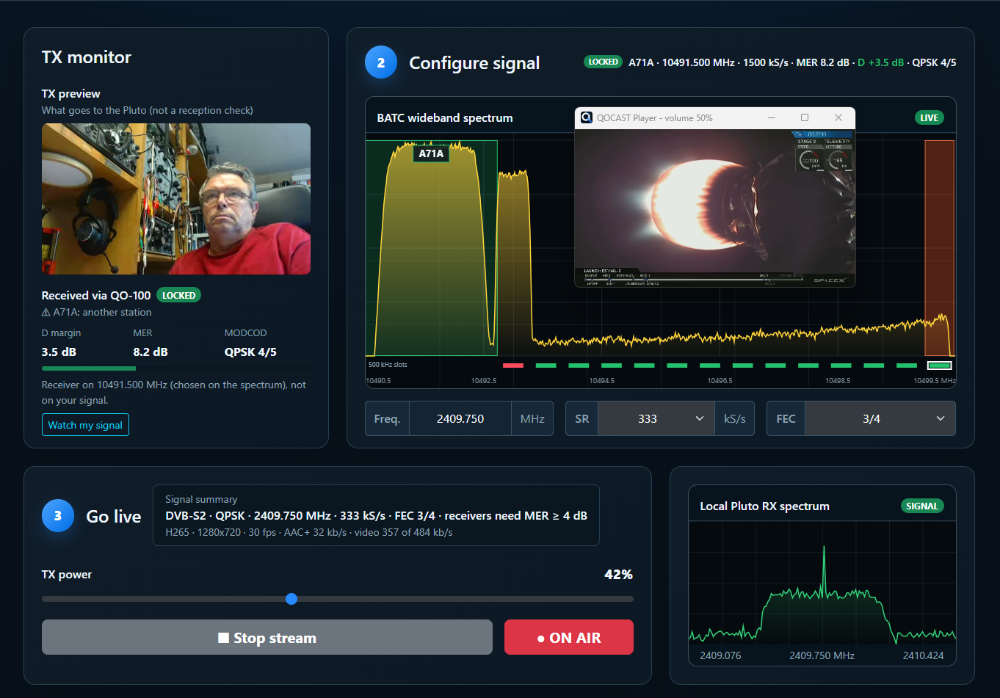

# QOCAST

**Browser-controlled QO-100 DATV transmit and receive console for Windows**, by HB9IIU.

QOCAST sends DVB-S2 video to the QO-100 satellite with an ADALM-Pluto
(PlutoDVB2 firmware by F5OEO), and shows what comes back with a MiniTiouner or
PicoTuner - all from one page in your browser.

## What makes QOCAST different

Like other DATV tools, QOCAST starts from a table of encoder settings for each
symbol rate and FEC (picture size, bitrates, audio). But a fixed table only fits
"average" pictures: a detailed film or a busy camera scene can need more than
the profile carries, and the stream overflows - viewers see glitches.

So QOCAST **tests what you actually send**, and adapts the settings to it:

- **Films:** at the first Start with a profile, QOCAST finds the three hardest
  30-second parts of the film, encodes them with the exact transmit command, and
  steps down only as far as needed (NVENC multipass, then a smaller picture, then
  fewer frames per second) until the stream has no overflows and keeps spare room.
  If there is room left over, the video gets more bitrate. The result is saved
  next to the film: the next Start is immediate.
- **Camera, Moblin and OBS:** a 20-second test, per profile, with your own scene
  (your room, your light, your phone in your hand), then the same check.
- **Testcards:** the moving ones (SBB clock, station card with marquee) are
  shipped with settings already tested for every profile.
- **On air:** QOCAST keeps watching. If a film still overflows, it is checked
  again, more carefully, at its next Start; for live sources the page says so.

Also built in:

- **Signal health at a glance:** one line tells you if your stream is good, too
  full or has errors, with a live bitrate bar (video, audio, overhead, spare) and
  TR 101 290 checks behind it.
- **See yourself come back:** while on air, QOCAST tunes its own OpenTuner to
  your downlink and shows your picture received back through QO-100, with MER
  and D margin.
- **Start, then PTT:** the stream starts muted; the Pluto only transmits when
  you press PTT.
- **Moblin and OBS stay connected:** connect them once; start and stop the
  transmission as often as you like without touching the phone or OBS.
- **Use it from any device:** open `http://qocast.local:8080` on a tablet,
  phone or another PC on your home network.
- **Nothing to install or configure:** unzip and start. OpenTuner starts with
  QOCAST, finds your MiniTiouner or PicoTuner by itself and closes at Quit.

## Download

Get the latest `QOCast-Portable-x64.zip` from the **[Releases](../../releases)** page.
No installation: unzip it to a writable folder and run `CLICK-HERE-TO-START.cmd`.

## Features

- **Sources:** testcards with melody (SBB clock, station card with marquee,
  classic test card), webcam with microphone, iPhone camera with Moblin, OBS,
  video files
- **Settings that fit:** every film, camera, Moblin or OBS source is checked
  once per profile, so the stream fits the QO-100 bitrate without overflows
- **BATC wideband spectrum:** click a free (green) slot to choose your frequency
- **Start, then PTT:** the stream runs muted until you press PTT
- **Local Pluto RX spectrum:** see your own carrier
- **On-air monitor:** your own picture received back through QO-100
- **RX page:** watch QO-100 in the browser, click a signal to tune
- **Overlays** on camera and Moblin: callsign, locator, UTC time, scrolling text
- **Signal health:** status in words, live bitrate bar, TR 101 290 checks
- **Help page:** step-by-step setup of Moblin and OBS

## Requirements

- Windows 10 or 11, 64-bit
- An **NVIDIA graphics card** (the video is encoded with NVENC, H.265)
- **ADALM-Pluto** with the **PlutoDVB2 firmware** (F5OEO), connected by USB
- Optional, for receiving: a **MiniTiouner** or **PicoTuner** with its FTDI
  driver installed in Windows, and an LNB for the QO-100 downlink

## Starting and quitting

1. Run `CLICK-HERE-TO-START.cmd` (or `QOCast.exe`). The page opens in your browser at
   http://localhost:8080. OpenTuner starts minimized and connects your tuner by
   itself.
2. Set your callsign and locator on the **Setup** page.
3. To end: the **Quit** button at the top of the page.

Other devices on your network can use `http://qocast.local:8080` (or
`http://<this-PC-address>:8080`). There is no password: anyone on your home
network can open it.

## Included third-party software

QOCAST ships with FFmpeg (LGPL 2.1, with the Fraunhofer FDK AAC encoder),
TSDuck, the Varela Round font and the HB9IIU QOCAST OpenTuner (based on
OpenTuner by Tom ZR6TG, GPLv3). Their licences are in the `licenses` folder.

Source code of the HB9IIU QOCAST OpenTuner:
**[github.com/HB9IIU/QOCAST-OpenTuner](https://github.com/HB9IIU/QOCAST-OpenTuner)**

## Credits

- **Evariste F5OEO** for the PlutoDVB2 firmware
- **Tom ZR6TG** for OpenTuner
- **F1EJP** for DATV-Easy, the reference for the encoder settings
- **BATC** for the QO-100 wideband spectrum monitor
- **AMSAT-DL** and everyone who keeps QO-100 running

73 from HB9IIU!
